# ControllerDataCollector

This project is designed for collecting HMD and controller data in Unity (position, rotation) for sktime ML testing.

## System Requirements

- Unity version: 2022.3.8f1
- Required Package: Meta All-in-One
- Tested with: Meta Quest 3

## Unity Setup

Connect to Meta using Meta Quest Link.

1. **DataCollector**
   Press the button to start and stop recording (A or X for start, B or Y for stop). During the trigger period, all data will be recorded in the provided example CSV file. Once recording is complete, the data will be saved to the CSV to prevent data loss in case of a Unity failure.

2. **Classifier Test**
   Ensure the correct server script is running. (The most up-to-date version is high-dimensions-server.py.)
   Press the button to start and stop recording (A or X for start, B or Y for stop). The recording will be sent to the python server. The response will be lightly parsed into a text.

3. **Special Effect Scenes** (TBD)
   Visual, audio, and haptic feedback are associated with tracing and classification results.

4. **Generative AI Scene** (TBD)
   Classification results trigger the generative AI system.

## Preliminary Pattern Naming
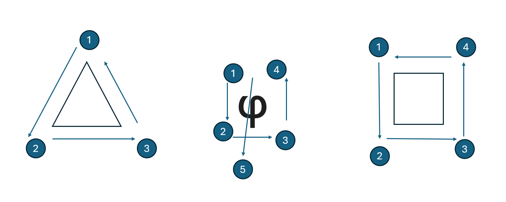

## ML Pipeline

### Data Processing 
#### Calculating Relative Positions
The calculating relative positions step transforms the (right) controller's position into the HMD's coordinate system using quaternion-based rotation matrices, ensuring accurate alignment of spatial data for further processing.

### Scaling
Scaling transforms the data to fit within a specified range, [0, 1], which ensures uniformity across features and improves model performance. This step normalizes variations in data magnitude, preventing features with larger scales from disproportionately influencing machine learning models.

The 3x2 image set showcases 3D plots of the dataset, illustrating the data before and after the relative position calculation and scaling steps to highlight how spatial transformations affect the positional data.

**Before Calculating Relative Positions and Scaling**
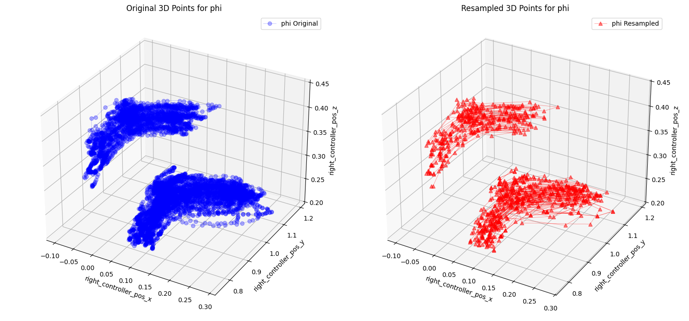
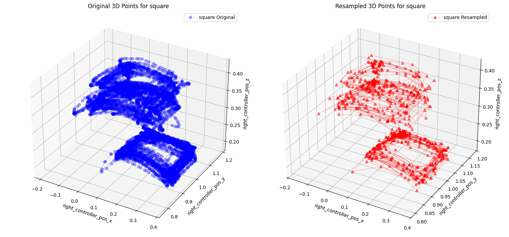
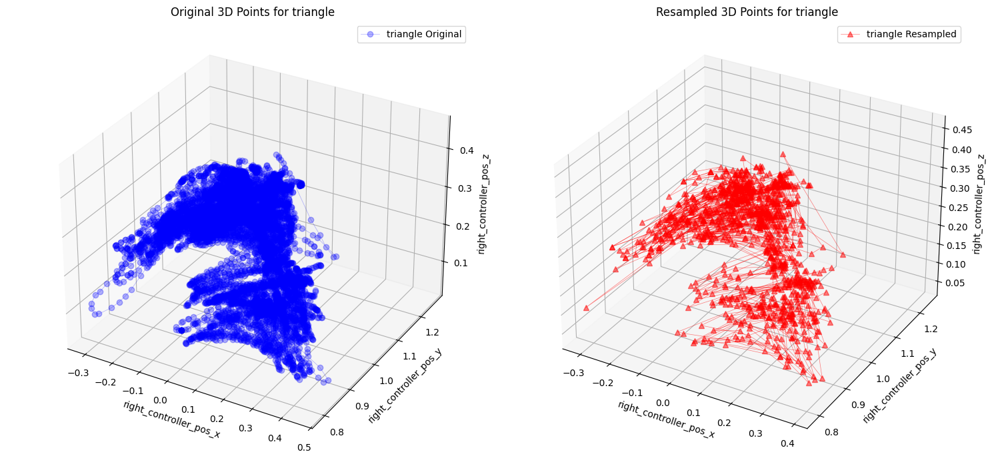
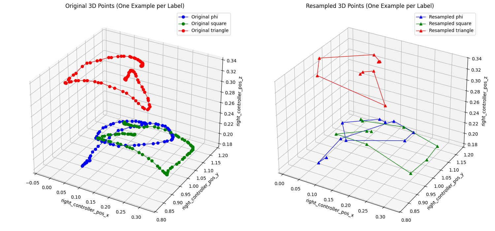

**After Calculating Relative Positions and Scaling**
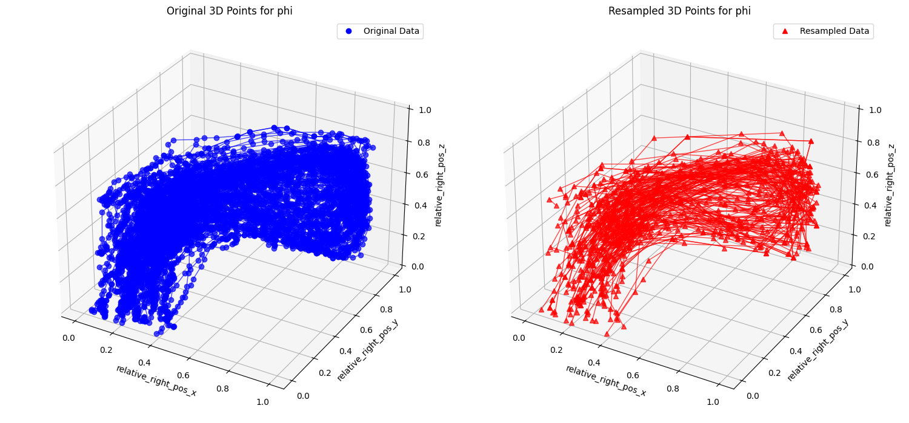
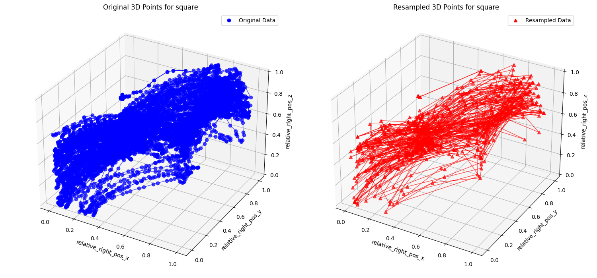
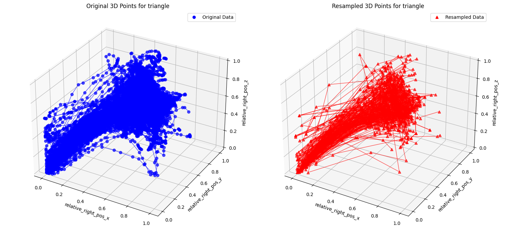
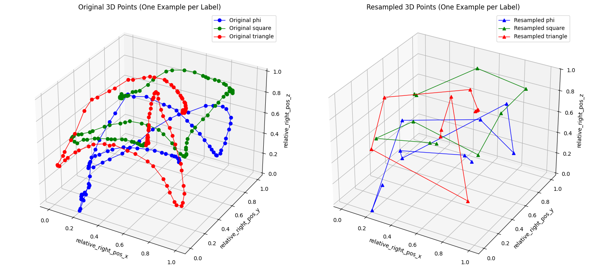

**2D Plots Before Scaling (After Calculating Relative Positions)**
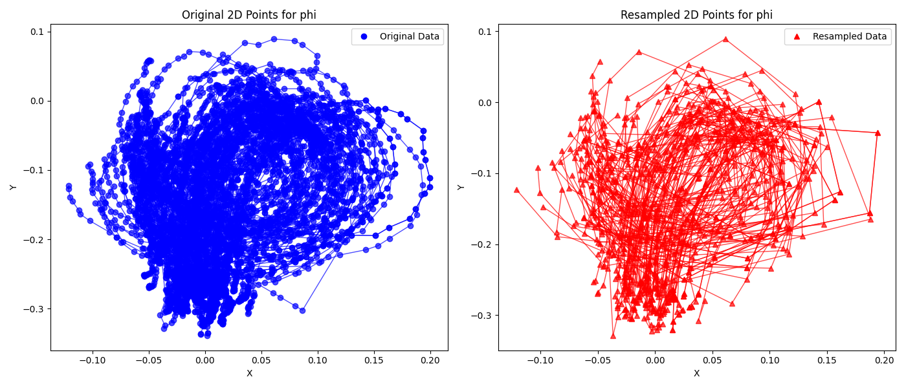
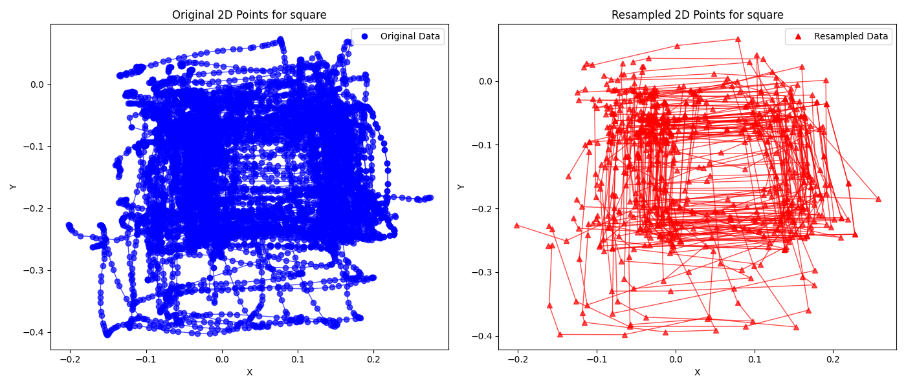
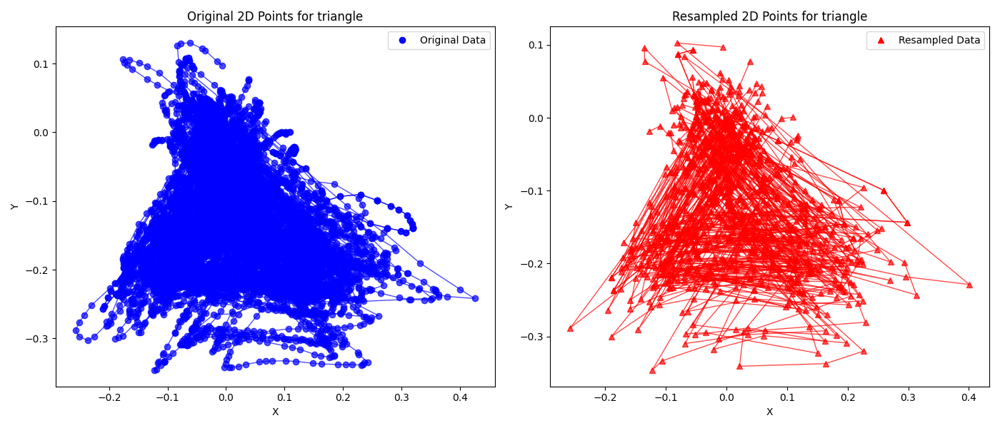

**2D Plots After Scaling (After Calculating Relative Positions)**
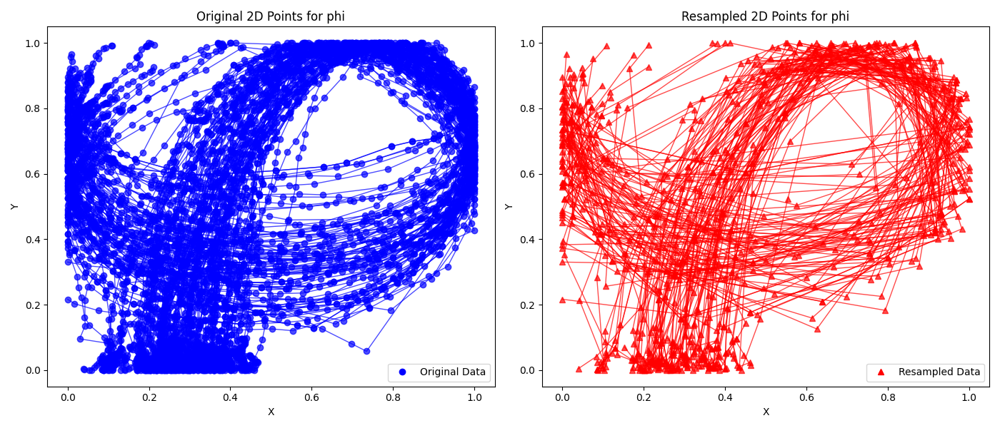
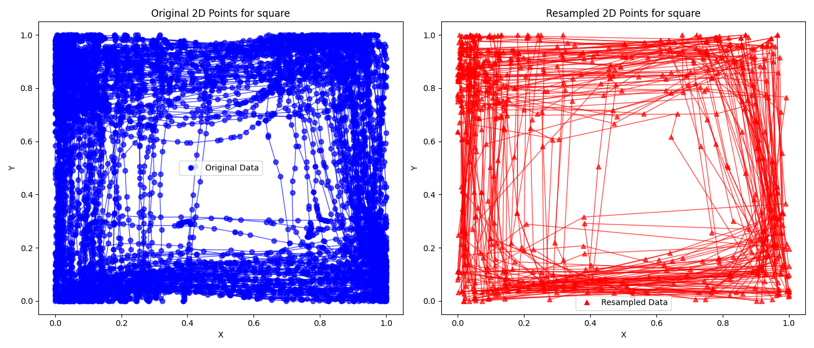
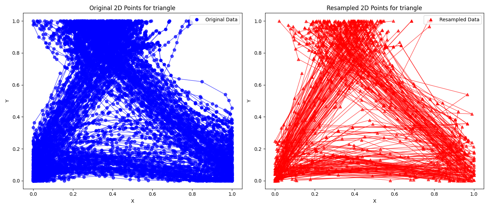
#### Resampling

### ML

#### Random Forest

Random Forest Model Test Evaluation:
Accuracy: 0.98
Precision: 0.98
Recall: 0.98
F1-Score: 0.98

Classification Report:
              precision    recall  f1-score   support

       r_phi       1.00      1.00      1.00        27
    r_square       1.00      0.91      0.95        22
  r_triangle       0.95      1.00      0.97        35

    accuracy                           0.98        84
   macro avg       0.98      0.97      0.97        84
weighted avg       0.98      0.98      0.98        84

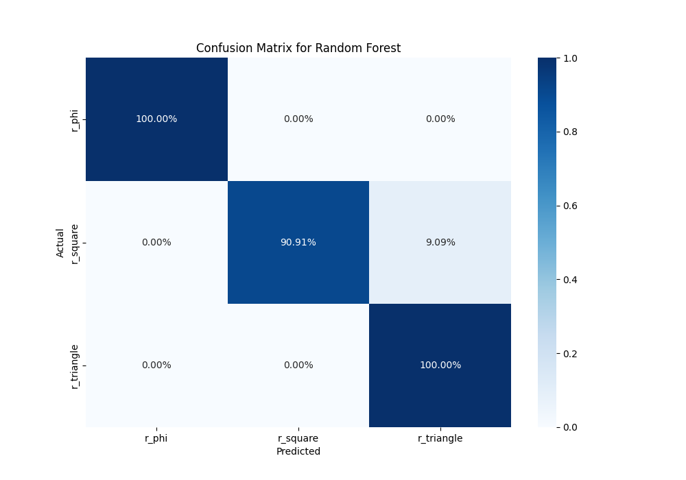

#### SVC

SVM Model Test Evaluation:
Accuracy: 0.99
Precision: 0.99
Recall: 0.99
F1-Score: 0.99

Classification Report:
              precision    recall  f1-score   support

       r_phi       1.00      1.00      1.00        27
    r_square       1.00      0.95      0.98        22
  r_triangle       0.97      1.00      0.99        35

    accuracy                           0.99        84
   macro avg       0.99      0.98      0.99        84
weighted avg       0.99      0.99      0.99        84

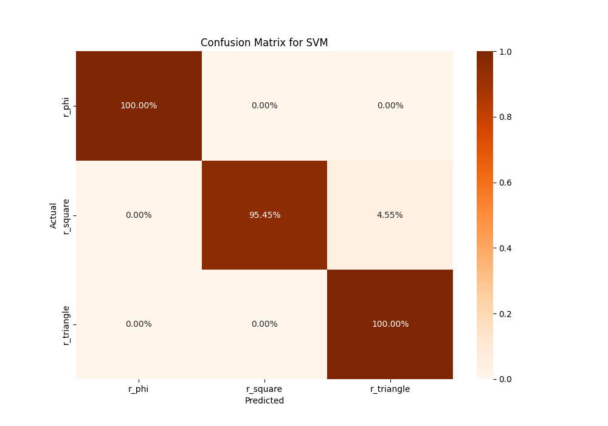

## Credit
Meta All-In-One helped a lot
The HMD & controllers data collection format is inspired from [Motion Learning Toolbox](https://github.com/cschell/Motion-Learning-Toolbox)
